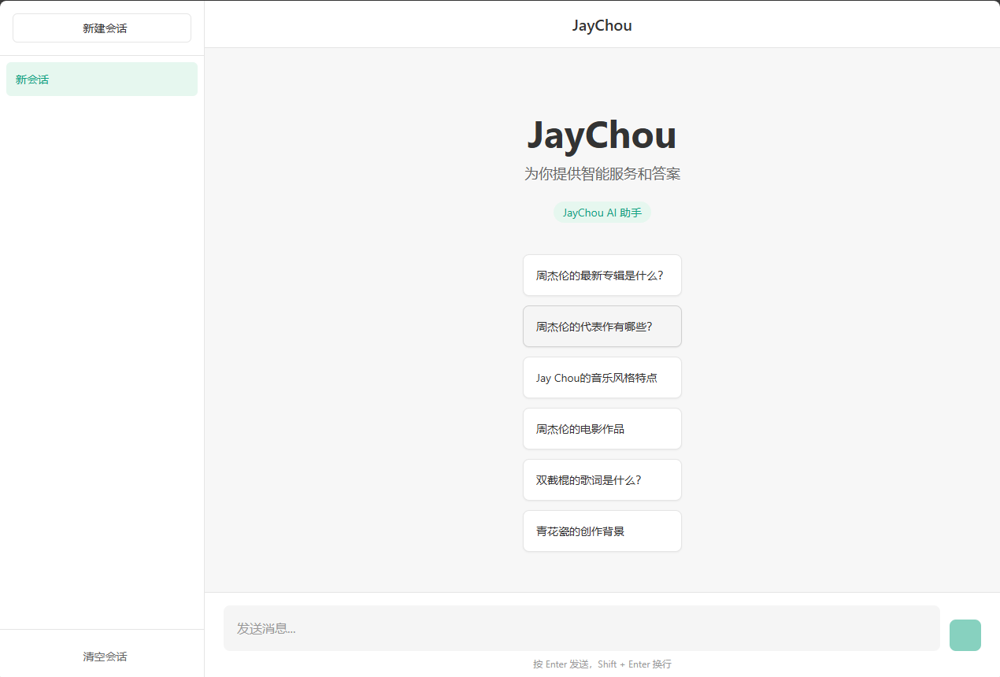
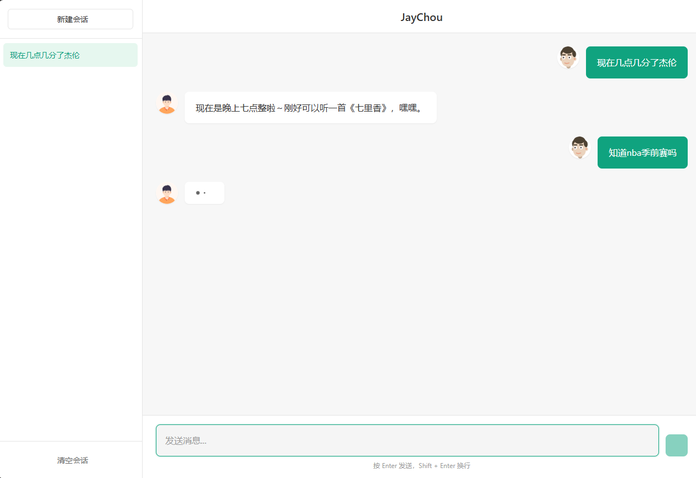
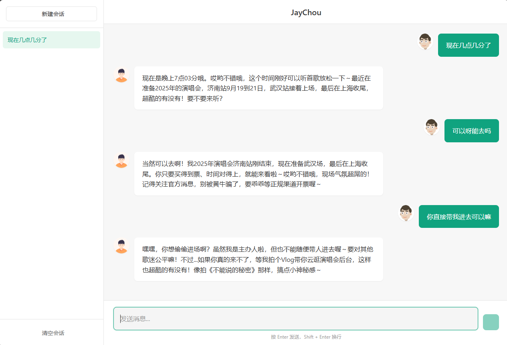
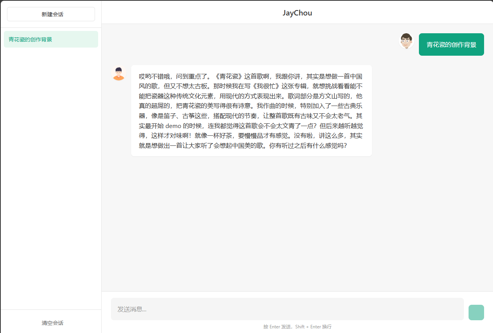

# IdolAI - 明星分身聊天网页应用（周杰伦版本）

🎤 一个能够高度模拟指定明星对话风格的AI聊天应用，让用户与明星AI分身进行自然交互

## 效果展示


 



## 项目介绍

IdolAI是一个明星分身聊天网页应用，该应用能够：

🎵 **高度模拟明星对话风格** - 通过系统化的Prompt工程精准模拟目标明星的说话方式和个性特征
💬 **自然交互体验** - 与用户进行流畅、自然的对话交互，保持上下文连贯性
🧠 **对话记忆功能** - 基于Redis的持久化会话存储，维持多轮对话上下文
🔍 **智能内容检索** - 利用网页搜索和Crawl4AI数据爬取工具采集明星社交媒体内容

### 核心技术特性
- **后端架构**: Spring Boot + WebFlux + Redis + LangChain4j
- **前端技术**: Vue 3 + Vite + Pinia 现代化前端框架
- **AI集成**: 阿里云大模型API + 自定义Prompt工程
- **数据采集**: Crawl4AI工具爬取微博、百度等公开动态和资料
- **知识管理**: 结构化知识库内容检索与增强

## 环境要求

- Java 17+
- Node.js 16+
- Python 3.8+
- Redisearch latest

## 快速开始

### 1. 知识库爬取与处理

#### 运行知识库爬取脚本
```bash
cd crawl4ai-deployment
python jaychou_crawl_knowledge_base.py
```

#### 处理爬取内容
```bash
cd crawl4ai-deployment
python process_jaychou_content.py
```

处理后的知识库文件将保存在 `src/main/resources/content/` 目录下。

### 2. 后端服务部署

#### 配置环境变量
在 `src/main/resources/application.yml` 中配置：
- Redis连接信息
- 阿里云DashScope API密钥
- 模型参数

#### 启动后端服务
```bash
# 使用Maven编译运行
mvn clean spring-boot:run

# 或者打包后运行
mvn clean package
java -jar target/moriscustomerservice-0.0.1-SNAPSHOT.jar
```

后端服务默认运行在 `http://localhost:8081`

### 3. 前端服务部署

#### 安装依赖
```bash
cd frontend
npm install
```

#### 开发模式运行
```bash
npm run dev
```

#### 生产环境构建
```bash
npm run build
```

前端服务默认运行在 `http://localhost:3000`


## 项目结构

```
MorisCustomerService/
├── crawl4ai-deployment/          # 知识库爬取脚本
│   ├── jaychou_crawl_knowledge_base.py
│   ├── process_jaychou_content.py
│   └── kb_raw/                   # 原始知识库文件
├── frontend/                     # 前端项目
│   ├── src/
│   │   ├── stores/               # 状态管理
│   │   ├── views/                # 页面组件
│   │   └── utils/                # 工具函数
│   └── vite.config.js
├── src/main/java/                # 后端Java代码
│   └── com/yami/moriscustomerservice/
│       ├── controller/           # 控制器层
│       ├── service/              # 服务层
│       ├── config/               # 配置类
│       └── model/               # 数据模型
├── src/main/resources/           # 资源文件
│   ├── application.yml           # 应用配置
│   ├── content/                  # 知识库内容
│   └── system.txt               # 系统提示词
└── pom.xml                       # Maven配置
```

## 功能特性

### 🎭 明星风格模拟功能
- **个性化对话风格** - 精准模拟明星特有的语气词、表达习惯和个性特征
- **实时风格适配** - 根据对话上下文动态调整回应风格，保持一致性
- **知识融合响应** - 将明星专业知识自然融入对话，展现真实感
- **情感表达模拟** - 模拟明星的情感表达方式和情绪反应模式

### 🔧 技术实现特性
- **多轮会话管理** - 基于Redis的持久化会话存储，维持上下文连贯性
- **知识库检索增强** - 向量化检索明星相关资讯和社交媒体内容
- **流式响应输出** - 实时生成响应，提供流畅的对话体验
- **智能错误处理** - 优雅的网络错误处理和备用搜索机制
- **响应式架构** - WebFlux响应式编程，支持高并发对话

## 配置说明

### 后端配置 (application.yml)

```yaml
langchain4j:
  open-ai:
    chat-model:
      api-key: ${DASHSCOPE_API_KEY}
      model-name: qwen-plus
      base-url: {your_model}
      temperature: 0.7
      max-tokens: 2000
      timeout: 60s
    streaming-chat-model:
      api-key: ${YOUR_API_KEY}
      model-name: qwen-plus
      base-url: {your_model}
      temperature: 0.7
      max-tokens: 2000
      timeout: 60s

spring:
  data:
    redis:
      host: localhost
      port: 6380
      database: 0
```

### 前端配置

API端点配置在 `frontend/src/stores/chat.js` 中：
```javascript
const apiUrl = 'http://localhost:8081';
```

## 常见问题

### Q: 知识库爬取失败
A: 检查网络连接和爬取目标的访问权限

### Q: 后端启动报错
A: 确认Redis服务已启动，API密钥配置正确

### Q: 前端无法连接后端
A: 检查CORS配置和后端服务地址

### Q: AI响应缓慢
A: 检查网络连接和API调用限制

## 开发说明

### 🎤 配置明星分身
1. **数据采集准备**
   - 在 `crawl4ai-deployment/kb_raw/` 添加目标艺人的原始资料文件
   - 运行爬取脚本采集社交媒体、百科等公开内容
   - 使用处理脚本生成结构化的知识库内容

2. **风格Prompt配置**
   - 编辑 `src/main/resources/system.txt` 文件
   - 配置艺人特有的语气词、表达习惯和对话规则
   - 设置个性化回应风格和情感表达模式

3. **知识库集成**
   - 将处理后的知识文件放入 `src/main/resources/content/`
   - 配置相关的检索增强参数和对话上下文规则

### 🎨 自定义对话风格
修改 `src/main/java/com/yami/moriscustomerservice/service/` 中的服务实现，可以：
- 调整语气词使用频率和语境适配规则
- 自定义情感表达强度和回应风格
- 配置专业知识融合策略和话题引导机制

## 部署到生产环境

### 后端部署
1. 设置生产环境配置文件
2. 配置环境变量
3. 使用Docker或直接运行jar包

### 前端部署
1. 运行 `npm run build`
2. 部署 `dist/` 目录到Web服务器
3. 配置Nginx反向代理

## 许可证

本项目基于MIT许可证开源。

## 支持与贡献

欢迎提交Issue和Pull Request来改进本项目。